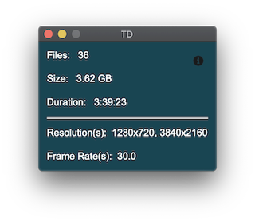

# Total Duration 
Calculates total duration and list resolution and frame rates of media files. 



This works with video, audio, and images.  
Images will just display a resolution. 

This has been tested on Mac, Windows, and Linux.

## How to Use
Select files and/or folders, drag and drop onto app.


## Installation
You will need to download a static version of ffprobe.  
Visit https://www.ffmpeg.org/download.html where you can download the ffmpeg package (includes ffprobe). Look under the "Get packages & executable files" section. 
After downloading, drag the ffprobe executable into the Get_Total_Duartion folder.

It's recomeneded to create a virtual environment and activate.
```bash
python -m venv env
source env/bin/activate
```
Install requirements
```bash
pip install -r requirements.txt
```
Then simply build the app! The spec file is setup to work with Mac, Windows, and Linux operating systems. 
```bash
pyinstaller main.spec
```
The app will be built in *Get_Total_Duration > dist* 

## Trouble Shoot Build
If you used PyEnv to install Python, you may get a "Python Library not Found error."  You will need to use the "--enable-shared" arguments when installing python. See below.
https://pyinstaller.readthedocs.io/en/stable/development/venv.html