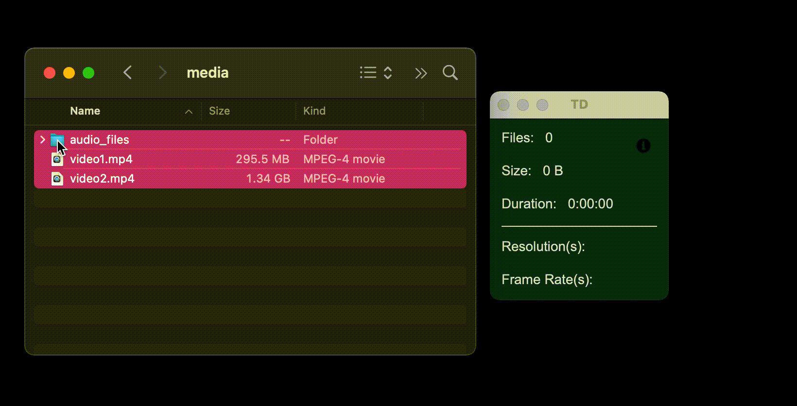
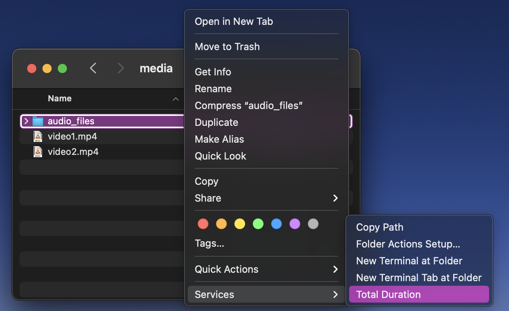
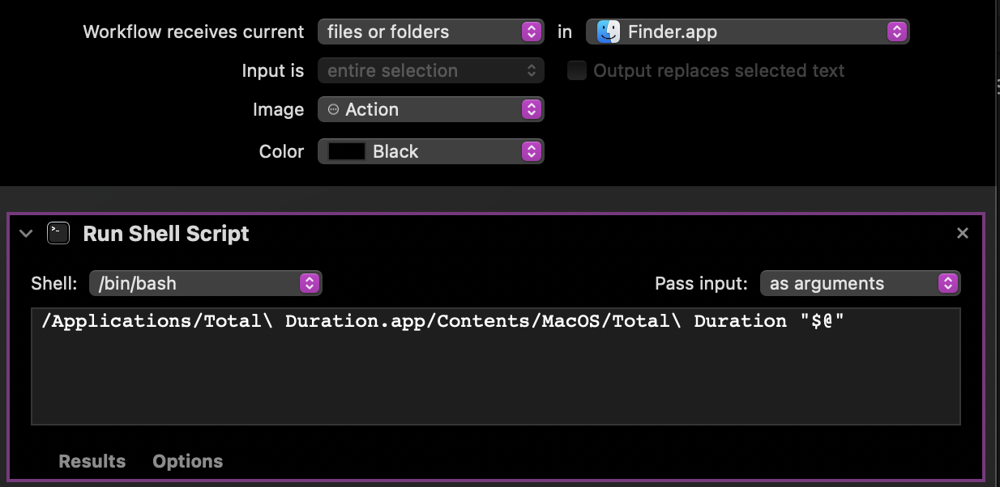

# Total Duration 
Calculates total duration and list resolution and frame rates of media files. 



Works with: 
- video
- audio
- images

*Images will just display a resolution*

Tested on: 
- Mac
- Windows
- Linux

## How to Use
Select files and/or folders, drag and drop onto app. 

It is recursive so it will dig through all folders.

## **Installation**
#### **DIRECT DOWNLOAD**
You can download the fully built app under the "Releases" section of this Github page.  
Or...
  
#### **MANUAL BUILD**
**You will need to download a static version of ffprobe**  
> Visit https://www.ffmpeg.org/download.html where you can download the ffmpeg package (includes ffprobe) depending on your OS.  
Look under the "Get packages & executable files" section.  

After downloading, drag the ffprobe executable into the Get_Total_Duartion folder.

It's recomeneded to create a virtual environment and activate.
```bash
python -m venv env
source env/bin/activate
```
Install requirements
```bash
pip install -r requirements.txt
```
Then simply build the app! The spec file is setup to work with Mac, Windows, and Linux operating systems. 
```bash
pyinstaller main.spec
```
The app will be built in *Get_Total_Duration > dist* 

## BONUS: MacOS Right-Click Service
You can install a right-click service to run Total Duration striaght from Finder.  
This service is available with the "Total Duration.workflow" file from the Releases section of this github page.  
*Total Duration app must be in Applications Folder for this to work.*



OR...  
If you prefer to create the service yourself, here is how to do it in Automator.



## Troubleshoot Build
If you used PyEnv to install Python, you may get a "Python Library not Found error."  
You will need to use the "--enable-shared" arguments when installing python. See: 
https://pyinstaller.readthedocs.io/en/stable/development/venv.html